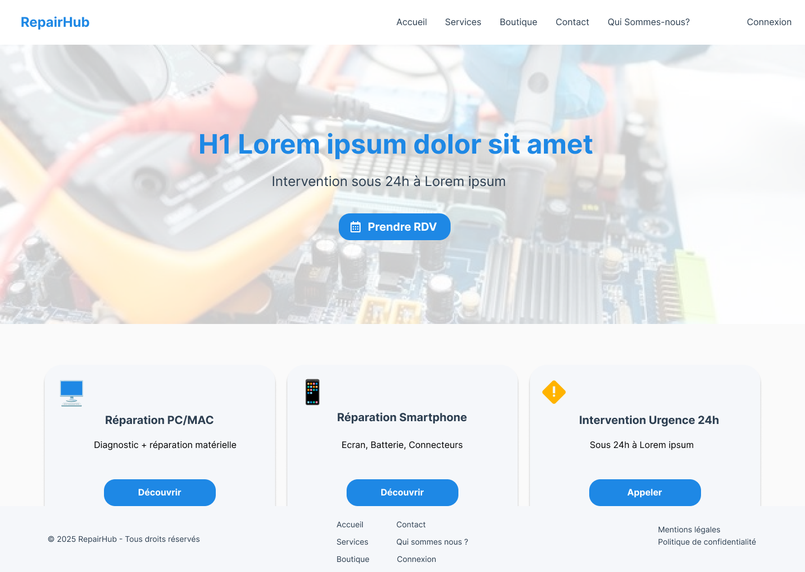

# RepairTarn - Thème & Plugin Block Theme WordPress

Thème block WordPress + plugin CPT Tickets pour le projet RepairHub (MMI Toulouse).

## Fonctionnalités

### Thème Block
- **Design System intégré** : palette 6 couleurs, typo Inter, styles cohérents via `theme.json`.  
- **Page d'accueil fidèle** : héro avec overlay, 3 cartes services, header/footer responsive.  
- **Full Site Editing** : tout est éditable via l'éditeur de site (header, footer, blocs).  
- **Styles CSS** : ombres, arrondis, boutons cohérents avec le design system.

### Plugin Tickets
- **CPT `rt_ticket`** : gestion complète des tickets de réparation.  
- **Taxonomie `rt_ticket_status`** : Ouvert, En cours, Annulé, Résolu.  
- **Meta box** : technicien, appareil, description courte, dates dépôt/prise en charge, priorité.  
- **Shortcode `[rt_ticket id="123"]`** : affiche une carte ticket avec statut coloré.

## Installation

### 1. Thème
1. Copie le dossier `repairtarn/` dans `/wp-content/themes/`.  
2. Active le thème dans **Apparence → Thèmes**.  
3. Personnalise via **Apparence → Éditeur** (Full Site Editing).

### 2. Plugin Tickets
1. Copie `repairtarn-tickets.php` dans `/wp-content/plugins/repairtarn-tickets/`.  
2. Active le plugin dans **Extensions**.  
3. Crée des tickets dans **Tickets** (nouveau menu admin).  
4. Affiche une carte avec `[rt_ticket id="123"]`.

## Design System

| Élément | Couleur | Usage |
|---------|---------|-------|
| Bleu primaire | `#1E88E5` | Titres, boutons principaux |
| Orange secondaire | `#FFB300` | Statut "En cours" |
| Vert succès | `#4CAF50` | Statut "Résolu" |
| Fond carte | `#F5F7FA` | Cartes, footer |
| Texte principal | `#2C3E50` | Titres, textes |
| Fond | `#FAFAFA` | Header, arrière-plan |

## Responsive
- Desktop : 1200px max-width.  
- Mobile : colonnes stackées, boutons adaptatifs.

## Structure technique

